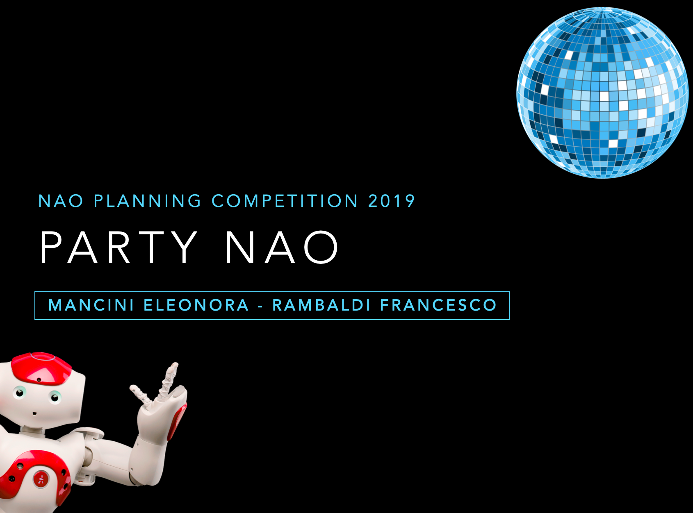
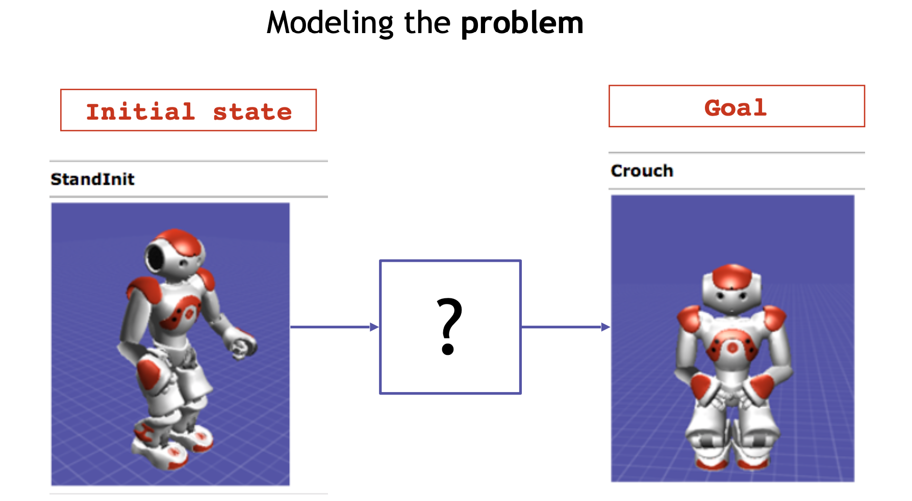
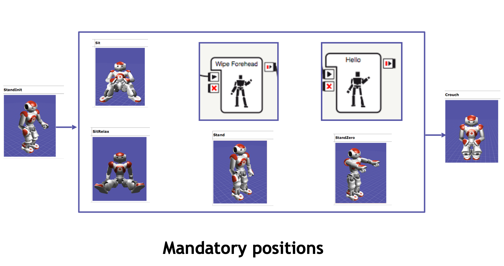

# PartyNAO

Project realized by [Eleonora Mancini](https://github.com/helemanc) and [Francesco Rambaldi](https://github.com/rambo1996) as a part of the 	*Fundamentals of Artificial Intelligence and Knowledge Representation* 
exam  of the [Master's degree in Artificial Intelligence @ University of Bologna](https://corsi.unibo.it/2cycle/artificial-intelligence) (A.A. 2019-2020).

In particular, this project has been realized in the context of the *NAO Planning Competition - 2019*.

**AI and Creativity**

With our project we want to convey the idea of A.I. by creating fully automatic system (from song selection to choreography generation).

We used **simulated annealing**, which has a probabilistic component, because it allows us to find a different solution every time. 

This simulates the concept of live performance, which we think can excite the spectator, because it is unpredictable.
## Context 
This project is part of the *NAO Planning Competition - 2019*, a competition with the aim of mixing AI with creativity. 

**Objective**

Deploying an algorithm to generate transitions between different positions.

Create a choreography for the NAO robot so that is: 
- fully automated using AI techniques
- suitable for the song that is selected **randomly** 

**Learning Outcomes**
- to devise techniques for automatic and creative generation of complex movements in robots, such as choreographies
- strong interdisciplinarity, involving robot learning, human-robot interaction, cognitive studies of movement, creativity

**Problem statement**

In order to model the problem we had at our disposal: 
- an initial state and a goal state 
- a set of mandatory positions 

**Constraints to be satisfied**

- possible incompatibilities between two consecutive positions (use of
simulator in Choreographe to understand if and what they are)
- time constraints (max 3 minutes)
- constraints on the number of intermediate positions to be used in the whole choreography

## Description
**Main aspects**
- **Association** of a **move** with the **amplitude** of the **song** at a given moment
- Use of **multi-thread** for the management of the:
  - Search algorithm 
  - Music detection 
  - Execution of the choreography on the virtual robot 
- The **song is selected automatically** after running the program:
  - in the program folder there is a folder with all the possible example song
- Use of the Local Search Algorithm **Simulated Annealing**

---
The application flow can be divided in two main phases: 
- preparation 
- execution

---

**Preparation**
1. Generation of all the possible **pairs of moves**  
2. Store the **time** spent to go from one position to another while **testing** on the virtual robot the pairs of moves 
3. Generation of a **dictionary**: { (move_1, move_2) : time } 
4. Classification of the moves into 3 different classes:
   - Slow moves 
   - Normal moves 
   - Fast moves 
---
**Execution**
1. Decomposition of the main problem in **7 sub-problems**
2. Execution of simulated annealing **multiple times**
3. Selection of the **best solution**:
   - **Best solution** = respected **constraints** + total **number of moves** between 40 and 46
4. If there isn’t any solution which respects the constraints the execution restart from point 2. 
5. Start 2 threads:
   - Play song 
   - Connect to the robot and execute the choreography

## Prerequisites
| Library Name |
|:------------:|
|   argparse   |
|    ffmpeg    |
|     glob     |
|   itertools  |
|     math     |
|  matplotlib  |
|     naoqi    |
|     numpy    |
|   operator   |
|      os      |
|    pydub     |
|    random    |
|     scipy    |
|      sys     |
|   threading  |
|     utils    |

We tested our project on Linux system, so it is recommended to run the program on a UNIX system (4 GB of RAM at least).
## Usage
1. Download the *Music* folder from [here](https://drive.google.com/drive/folders/1VDmFieCwuFoKJ2GUx1eXweIFB8Q9SzJO?usp=sharing) and copy it in the *PartyNAO* main folder
2. Set the correct `port` of the robot (i.e. enable the connection with the robot):
   - If you are using a virtual robot on Choregraphe, open the "Robot browser" window and copy the `port` value showed there in the files: 
     - *party_nao_project.py*
     - *party_nao_problem_def.py*
   - If you are using a real robot, set the `port` of the real robot as `port` value in the files: 
     - *party_nao_project.py*
     - *party_nao_problem_def.py*
3. Open a terminal in the main folder of the project (i.e. `PartyNAO`) and run *party_nao_project.py* using the following command: `python party_nao_project.py`

----

Once started, our program will:
- select a song randomly from the *Music* folder 
- plot its amplitude
- run simulated annealing algorithm
- find the best sequence of moves for the selected song 
- automatically start the music and the choreography: let's party NAO!
## Demo 
In [this](https://github.com/helemanc/PartyNAO/tree/main/demo) folder you can find a short demo of our application in *.mp4* format.

## Authors
Eleonora Mancini, Francesco Rambaldi 

## License 
This project is licensed under the Apache License 2.0 - see the [LICENSE](https://github.com/helemanc/PartyNAO/blob/main/LICENSE) file for details.

